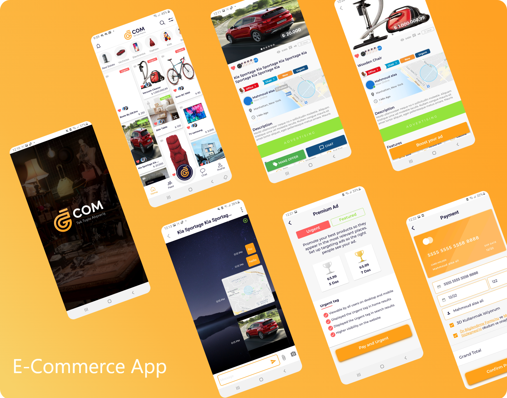
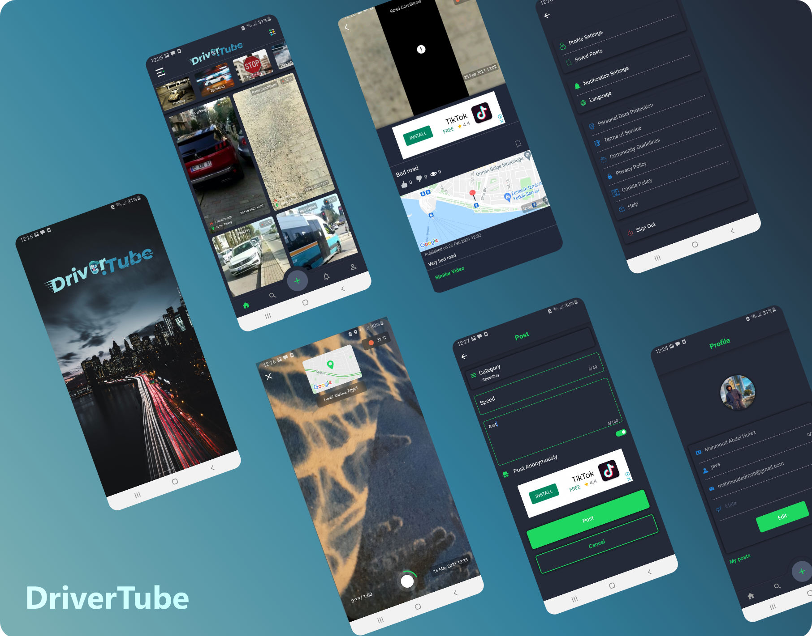
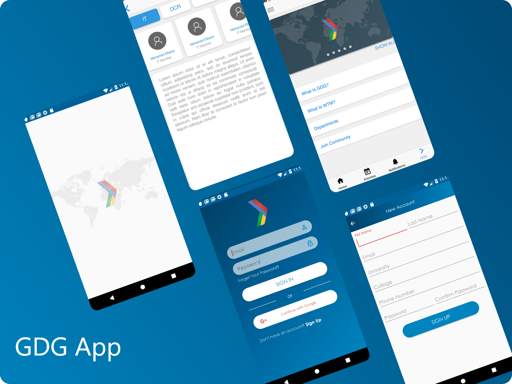
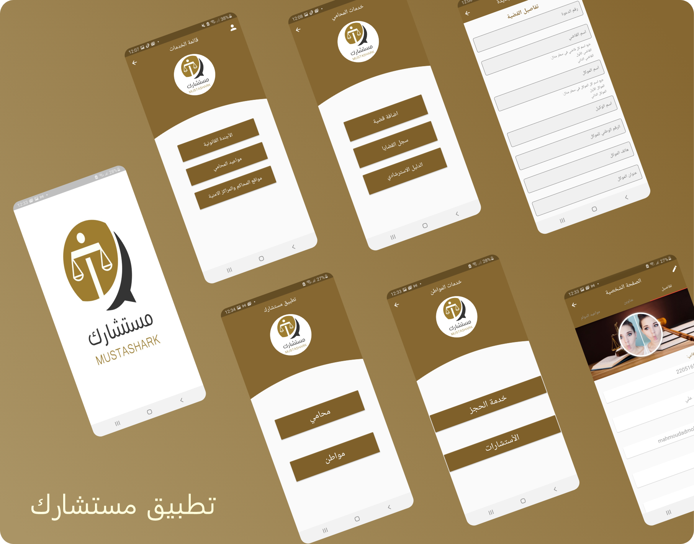
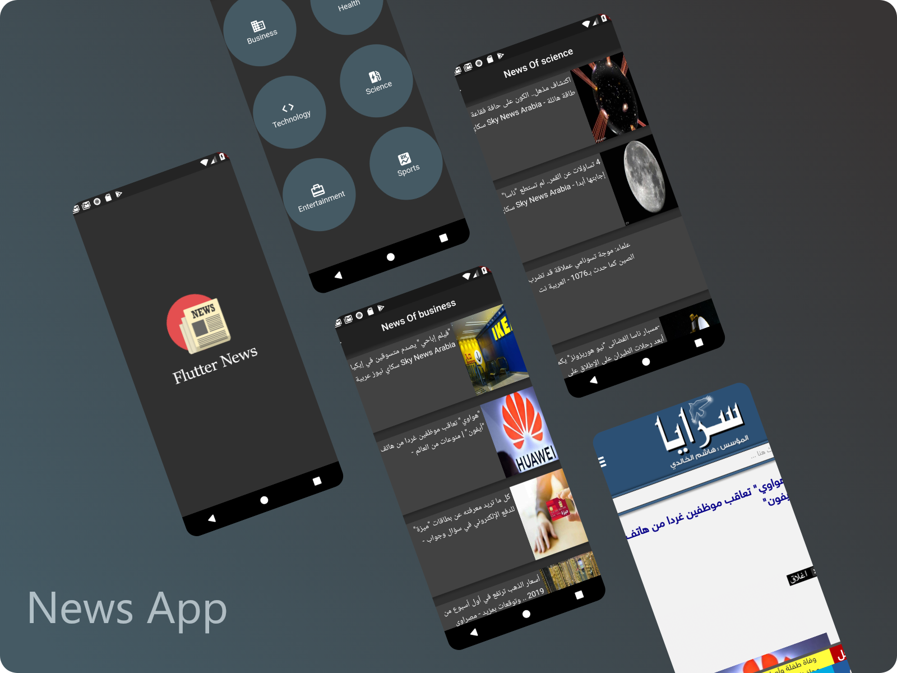
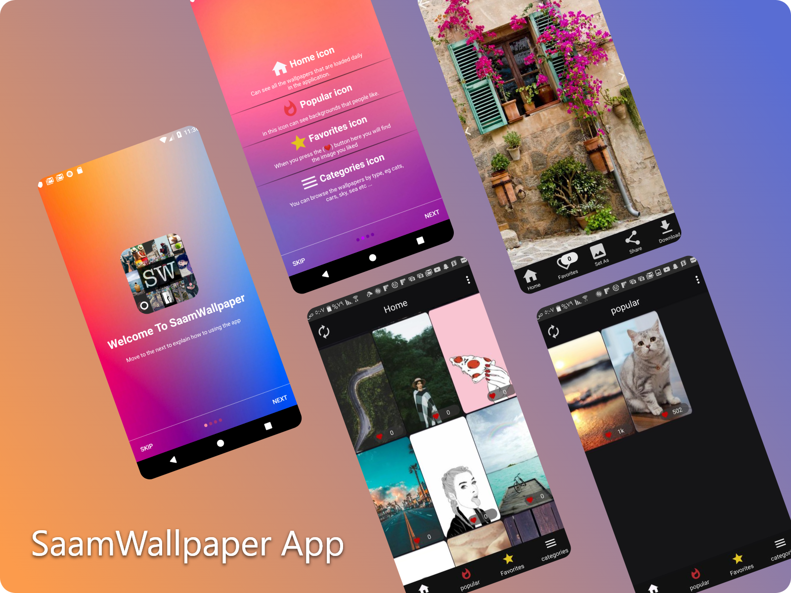
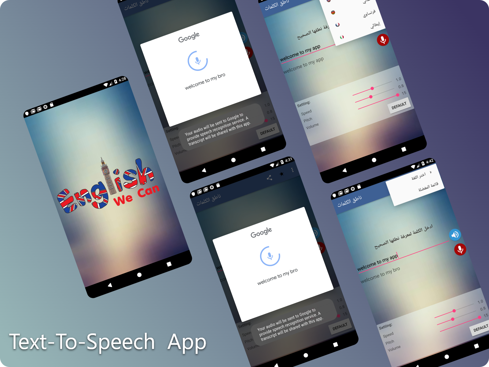

# About Me
<h2 align="center">Hello 👋,I'm Mahmoud alaa, Im an expert in Mobile Application Developer, Graduated from Computer Science.</h2>

  

 

This is some of my previous work by using `Flutter Framework`.

If You need to me build your custom app you can contact with me on **My Website** or **Social Media Accounts**.

 

 
 

# My Previous Work:

## E-Commerce App
Thanks to this platform, you can promote all kinds of new or second-hand vehicles, rental or sale residences, unimaginable numbers of electronic products, all kinds of things you do not need, under numerous categories, and communicate with buyers.

For you potential buyers, thanks to this application, which will bring a brand new breath to shopping, you will be able to reach everything you can think of, what you cannot find and need.

 

---------

## DriverTube App
Report Bad Drivers
If you witness any dangerous and reckless driving, parking violation, speeding violation, overtaking or traffic sign violations, this app will be your voice. Driver.Tube
> All Report any violation based GPS location, real time and weather, road conditions.

---------

## GDG App
GDG a news and management events system.

---------

## مستشارك App
تطبيق للمحاماة:
- يمكن للمواطن من حجز الاستشارات ومتابعتها من خلال التطبيق
- يمكن للمحامي من ادارة القضايا من خلال (اضافة قضية جديدة,سجل القضايا, الدليل الاسترشادي ,تنظيم المواعيد , مواقع المحاكم والمراكز الامنية )

---------

## News App

---------

## Wallpaper App
The application allows you to take backgrounds that fit your mood with more than 10,000 wallpapers. You can save them on your phone directly and share them with your friends on instagram, whatsapp etc without losing any background clarity. You can also experience the background on your phone before saving it in the gallery. For your phone .

---------

## Text-To-Speech App
Text To Speech apk content rating is Everyone and can be downloaded and installed on android devices supporting 17 api and above.

A very simple program is the correct pronunciation of words, which supports four languages `English`, `German`, `French` and `Italian`.
 
A great program to learn the correct pronunciation of the word essay or push of a button

The program is now faster than the previous screens and supports all versions

